指令分发服务接口设计说明
========================

(Instruction Distribution Service Interface Design Description)

|日期|修改人|修改内容|  
|:-:|:-:|:-|  
|2017-04-14|徐源|创建文档|  
|2017-05-04|徐源|用mermaid绘制流程图|

-	指令分发服务主要包含以下功能：

	-	解析集控中心用户交互服务提交的指令，依据指令目标，定位到正确的监控系统标准化接口地址，并转发指令内容  
	-	接收并处理监控系统标准化接口反馈的设备应答信息，呈现给用户

-	所有接口采用 HTTP 协议 post 方式请求, 地址格式为`http://ip:port/uas/interface_name`

-	提交的参数和返回数据格式为 Google Protocol Buffer ( protobuf ) 协议序列化后再经由 base64 编码得到的字符串

-	所有请求以及返回中的时间字段均采用Linux时间戳格式,精确到秒,int64类型

-	protobuf 协议格式说明

	-	协议采用 proto3 格式编写,使用 protoc v3.0 beta2 编译  
	-	所有时间字段，均采用Linux秒格式

-	头结构:

	-	该头结构将插入每个请求或返回的协议结构体中  
	-	协议类名加前缀 "rq" 表示客户端->服务端,无前缀表示服务端->客户端

```protobuf
message Head {
    int64 idx = 1;  // 序号(必填)
    int32 ver = 2;  // 协议版本(必填,默认为协议发布日期6位整型)。当前版本为 160328
    string if_name = 3;  // 接口名称(可选)
    string unique = 5;  // 移动设备唯一标示(移动设备填充,可以由服务器配置文件设置是否校验)
    int64 if_dt = 100;  // 请求或返回时间(必填)
    int32 if_st = 101;  // 接口操作状态(返回必填)
                            // 1-操作成功, 0-操作失败, 原因参考msg, 10-用户未登录或超时(0.5h),请求被拒绝, 11-用户权限不足,12-用户登录ip非法,需重新登录
                            // 41-数据库连接失败,42-指令提交失败(socket pool),43-第三方接口调用失败,45-数据库提交失败,46-参数错误,
			    // 99-接口参数暂不支持
    string if_msg = 102;  // 失败时填充详细原因(可选)
    repeated string msg_filter = 103;  // 调用接口后可能产生的消息过滤器，仅对设备操作类型接口有效，如终端开关灯、选测，客户端可以动态设置这些过滤器用来获得精准推送
    int32 paging_num = 200;  // 此次请求/应答是否使用分页(仅对非参数数据查询类接口有效,'query'开头的接口),0-不使用,大于0时使用,但是,若客户端请求的赋值>100或数据总量大于100,服务端按照100进行强制分页
    int32 paging_idx = 201;  // 分页序号,从1开始,当序号大于分页总数时返回空
    int32 paging_total = 202;  // 服务端返回该次请求产生的分页总数(客户端请求数据时不填充)
    int64 paging_buffer_tag = 203;  // 分页缓存标签,0-要求服务器重建缓存,xx-根据服务器返回的tag从对应缓存读取数据
    int32 paging_record_total = 204;  // 查询记录总数
}
```

-	通用应答

	-	通用应答仅包含head信息，用于不需要添加附加数据的场合

```protobuf
message CommAns {
    Head head = 1;  // 协议头信息
}
```

启动参数设计
------------

|参数名称|类型|默认值|说明|  
|:-:|:-:|:-|:-|  
|conf|string|None|必填参数。指定服务启动时读取的配置文件名以及路径，可使用绝对路径或相对路径|  
|debug|bool|False|指定服务是否以调试模式启动，在调试模式下，会向控制台输出日志|  
|hp|bool|False|高性能模式,采用torodo的fork_process模式启动|  
|version|bool|False|包含改参数时，服务打印当前程序版本信息后退出，忽略其他参数|

-	注：

	-	若启动时，未指定`conf`参数，则程序打印出启动参数帮助信息后退出  
	-	若指定的配置文件不存在，则程序在指定路径下使用默认值自动创建一个新的配置文件

配置文件设计
------------

-	配置文件为utf8格式文本文件  
-	配置文件中的每个配置项均由key，value，remark三部分组成，格式如下：

```ConfigFile
# remark
key=value
```

|关键字|配置默认值|说明|  
|:-:|:-:|:-|  
|log_level|10|日志记录等级, 10-debug, 20-info, 30-warring, 40-error|  
|bind_port|10008|本地监听端口|  
|db_host|127.0.0.1:3006|集控中心数据库服务地址, ip:port, 端口默认3306|  
|db_user|root|集控中心数据库服务用户名|  
|db_pwd|lp1234xy|集控中心数据库服务密码|  
|db_name|mydbjkzx|集控中心数据库名称|  
|uas_addr|http://127.0.0.1:10009/uas |统一验证服务地址|

数据库设计
----------

-	数据库表结构如下：

	-	用户信息表(user_info)：  
		|序号|列名|类型|备注|  
		|:-:|:-|:-|:-|  
		|1|user_id|int(11)|用户id|  
		|2|user_alias|varchar(50)|用户别名|  
		|3|user_remark|text|备注|  
	-	项目信息表(project_info)：  
		|序号|列名|类型|备注|  
		|:-:|:-|:-|:-|  
		|1|project_id|int(11) AUTO_INCREMENT|项目id,自增|  
		|2|project_name|varchar(50)|项目名称|  
		|3|project_ip|char(15)|项目ip|  
		|4|project_port|smallint(5)|项目端口号|  
		|5|project_root|varchar(50)|项目根路径，默认'/'|  
		|6|area_id|int(11)|所属区域id|  
		|7|project_active|tinyint(4)|项目是否启用|  
		|8|project_remark|text|备注|  
	-	用户项目权限表(user_project)：  
		|序号|列名|类型|备注|  
		|:-:|:-|:-|:-|  
		|1|user_id|int(11)|用户id|  
		|2|project_id|int(11)|项目id|  
		|3|user_auth|tinyint(3)|权限值, 参考下面权限说明|  
	-	事件信息表(events_info)：  
		|序号|列名|类型|备注|  
		|:-:|:-|:-|:-|  
		|1|event_id|tinyint(3)|事件ID|  
		|2|event_name|varchar(50)|事件名称|  
		|3|event_class_id|int(11)|事件类别id|  
		|4|event_class_name|varchar(50)|事件类别名称|  
		|5|event_ip|int(11)|产生事件的远端ip|  
		|6|event_remark|text|备注|  
	-	事件日志表(events_log)：  
		|序号|列名|类型|备注|  
		|:-:|:-|:-|:-|  
		|1|events_log_id|int(11) AUTO_INCREMENT|自增id|  
		|2|event_id|tinyint(3)|事件ID|  
		|3|event_time|bigint(20)|事件发生时间|  
		|4|user_id|int(11)|产生事件的用户id|  
		|5|event_remark|text|备注|  
		|6|project_id|int(11)|项目id|  
		|7|tml_id|int(11)|设备id|  
	-	区域信息表(areainfo)：  
		|序号|列名|类型|备注|  
		|:-:|:-|:-|:-|  
		|1|area_id|int(11) AUTO_INCREMENT|区域ID,自增|  
		|2|area_parent|int(11)|上级区域id|  
		|3|area_name|varchar(50)|区域名称|  
		|4|area_remark|text|备注|  

-	数据库初始化脚本如下：

@import "jkzx.sql"

权限系统设计
------------

-	权限系统仿照Linux系统权限架构经过简化设计而成，权限最终绑定至每个项目。  
-	系统默认包含admin用户，该用户只可以修改密码，不得删除或修改用户名
-	权限代表值如下：
	-	0 - N(无权限)
	-	1 - X(可操作)  
	-	2 - W(可设置)  
	-	4 - R(可查询)  
	-	3 - XW(可操作,可设置)  
	-	5 - RX(可查询,可操作)  
	-	6 - RW(可设置,可查询)  
	-	7 - RWX(可查询,可设置,可操作)  

接口设计
--------

### 项目信息获取

-	接口名称: projectinfo  
	> 查询项目信息

-	流程图：

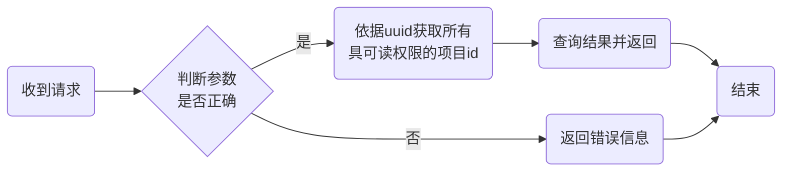

-	权限要求：

	1.	用户具有读权限

-	参数:

	1.	uuid - 登录成功获取的uuid
	2.	pb2 - 详细参数(结构如下)

```protobuf
message rqProjectInfo {
    Head head = 1;  // 协议头信息
    repeated int32 project_id = 2 [packed=true];  // 要查询的项目id,留空查询该用户有读权限的全部项目
}
```

返回:

```protobuf
message ProjectInfo {
    message ProjectView {
        int32 project_id = 1;  // 项目id
        string project_name = 2;  // 项目名称
        string project_address = 3;  // 项目访问地址 http://ip:port/root_path 格式
        int32 area_id = 4;  //  项目所属区域
        string project_remark = 5;  // 备注
    }
    Head head = 1;  // 协议头信息
    repeated ProjectView project_view = 2;
}
```

### 项目添加

-	接口名称: projectadd  
	> 添加项目

-	流程图：

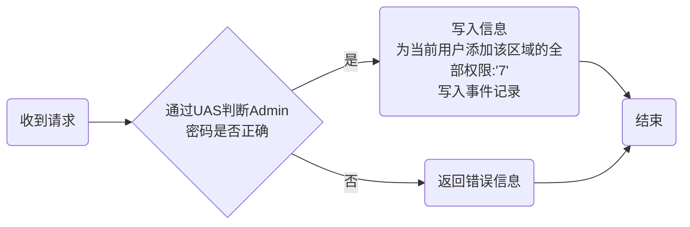

-	权限需求：

	1.	需要验证admin密码

-	参数:

	1.	uuid - 登录成功获取的uuid  
	2.	pb2 - 详细参数(结构如下)

```protobuf
message rqProjectAdd {
    Head head = 1;  // 协议头信息
    string project_name = 2;  // 新的项目名称
    string project_ip = 3;  // 新的项目接口ip
    int32 project_port = 4;  // 新的项目接口端口号
    string project_root = 5;  // 新的项目接口路径
    int32 area_id = 6;  // 新的项目所属区域
    string project_remark = 7;  // 新的备注
    string admin_pwd = 8;  // admin密码
}
```

返回: CommonAns()

---

### 项目修改

-	接口名称: projectedit  
	> 修改项目信息

-	流程图：

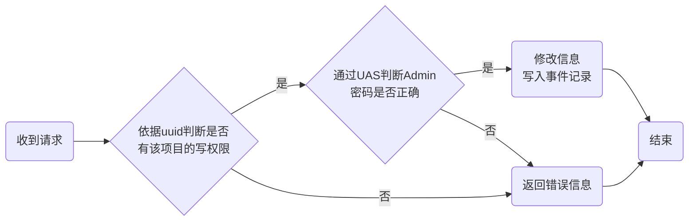

-	权限需求：

	1.	需要用户具有写权限
	2.	需要验证Admin密码

-	参数:

	1.	uuid - 登录成功获取的uuid  
	2.	pb2 - 详细参数(结构如下)

```protobuf
message rqProjectEdit {
    Head head = 1;  // 协议头信息
    string project_name = 2;  // 修改后的项目名称
    string project_ip = 3;  // 修改后的项目接口ip
    int32 project_port = 4;  // 修改后的项目接口端口号
    string project_root = 5;  // 修改后的项目接口路径
    int32 area_id = 6;  // 修改后的项目所属区域
    string project_remark = 7;  // 修改后的备注
    int32 project_id = 8;  // 项目id
}
```

返回: CommonAns()

---

### 项目删除

-	接口名称: projectdel  
	> 删除项目

-	流程图：

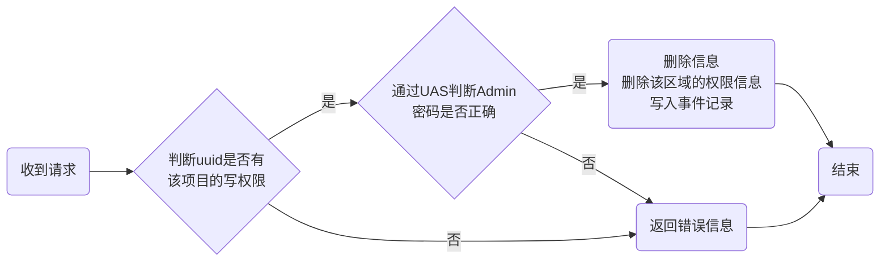

-	权限需求：

	1.	需要用户具有写权限
	2.	需要验证admin密码

-	参数:

	1.	uuid - 登录成功获取的uuid  
	2.	pb2 - 详细参数(结构如下)

```protobuf
message rqProjectDel {
    Head head = 1;  // 协议头信息
    int32 project_id = 2;  // 项目id
    string admin_pwd = 3;  // admin密码
}
```

返回: CommonAns()

---

### 区域信息获取

-	接口名称: areainfo  
	> 查询区域信息

-	流程图：


-	权限要求：

	无

-	参数:

	1.	uuid - 登录成功获取的uuid
	2.	pb2 - 详细参数(结构如下)

```protobuf
message rqAreaInfo {
    Head head = 1;
    repeated int32 area_id = 2 [packed=true];
    int32 get_child = 3;  // 默认0-返回输入的area_id的区域信息，1-返回以这些id作为父id的子区域信息
}
```

返回:

```protobuf
message AreaInfo {
    message AreaView {
        int32 area_id = 1;  // 区域id
        string area_name = 2;  // 区域名称
        int32 parent_id = 4;  // 上级区域id
    }
    Head head = 1;
    repeated AreaView area_view = 2;
}
```

---

### 区域添加

-	接口名称: areaadd  
	> 区域添加

-	流程图：

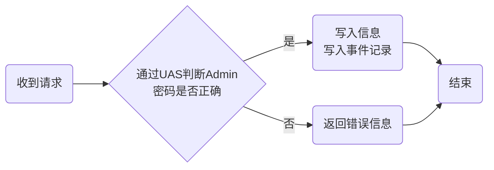

-	权限需求：

	1.	需要验证admin密码

-	参数:

	1.	uuid - 登录成功获取的uuid  
	2.	pb2 - 详细参数(结构如下)

```protobuf
message rqAreaAdd {
    Head head = 1;  // 协议头信息
    string area_name = 2;  // 新的区域名称
    int32 area_parent = 3;  // 区域父id
    string area_remark = 4;  // 备注
    string admin_pwd = 5;  // admin密码
}
```

返回: CommonAns()

---

### 区域修改

-	接口名称: areaedit  
	> 修改区域信息

-	流程图：

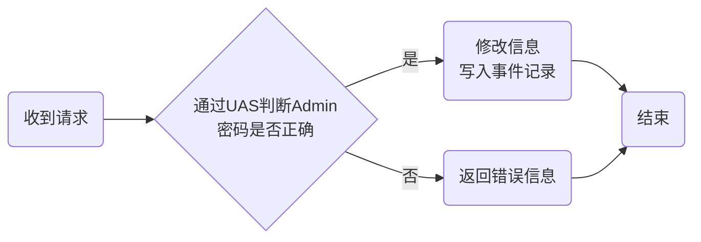

-	权限需求：

	1.	需要验证Admin密码

-	参数:

	1.	uuid - 登录成功获取的uuid  
	2.	pb2 - 详细参数(结构如下)

```protobuf
message rqAreaEdit {
    Head head = 1;  // 协议头信息
    string area_id = 2;  // 区域id
    string area_name = 3;  // 区域名称
    int32 area_parent = 4;  // 父区域id
    string area_remark = 5;  // 备注
    string admin_pwd = 6;  // admin 密码
}
```

返回: CommonAns()

---

### 区域删除

-	接口名称: areadel  
	> 删除项目，area_id为1的默认区域不得删除, 区域下还有项目的不允许删除

-	流程图：

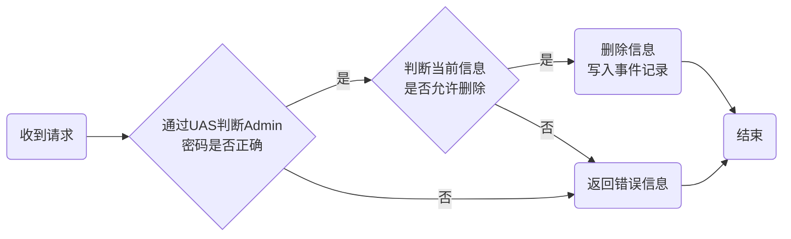

-	权限需求：

	1.	需要验证admin密码

-	参数:

	1.	uuid - 登录成功获取的uuid  
	2.	pb2 - 详细参数(结构如下)

```protobuf
message rqAreaDel {
    Head head = 1;  // 协议头信息
    int32 area_id = 2;  // 项目id
    string admin_pwd = 3;  // admin密码
}
```

返回: CommonAns()

---

### 用户权限设置

-	接口名称： userauthset  
	> 设置用户对项目的管理权限

-	流程图：

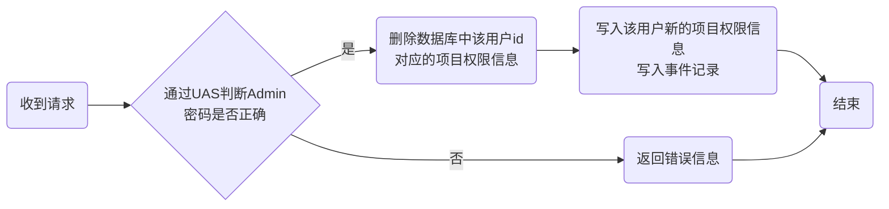

-	权限需求：

	1.	需要验证admin密码

-	参数:

	1.	uuid - 登录成功获取的uuid  
	2.	pb2 - 详细参数(结构如下)

```protobuf
message rqUserAuthSet {
    message ProjectAuth {
        int32 project_id = 1;  // 项目id
        int32 user_auth = 2;  // 用户权限值
    }
    Head head = 1;  // 协议头信息
    int32 user_id = 2;  // 用户id
    repeated ProjectAuth project_auth = 3;
    string admin_pwd = 4;  // admin密码
}
```

返回: CommonAns()

---

### 用户登录

-	接口名称: userlogin  
	> 用户登录

-	流程图：

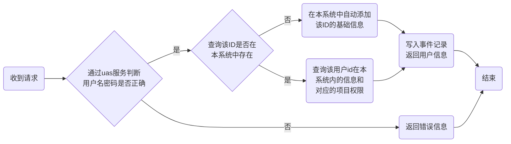

-	权限需求：

	-	无

-	参数:

	1.	uuid - 登录成功获取的uuid  
	2.	pb2 - 详细参数(结构如下)

```protobuf
message rqUserLogin {
    Head head = 1;  // 协议头信息
    string user_name = 4;  // 用户名
    string user_pwd = 5;  // 密码
}
```

返回:

```protobuf
message UserLogin {
    Head head = 1;  // 协议头信息
    string uuid = 2;  // 用户验证成功后分配的uuid(系统生成)
    string fullname = 4;  // 用户全名
    int32 user_id = 12;  // 用户id
    int32 mobile = 13;  // 用户手机
    string tel = 14;  // 用户电话
    string email = 15; // 用户邮箱
    string remark = 16； // 备注
    repeated int32 area_r = 9 [packed=true];  // 可读项目
    repeated int32 area_w = 10 [packed=true];  // 可写项目
    repeated int32 area_x = 11 [packed=true];  // 可操作项目
}
```

---

### 用户添加

-	接口名称: useradd  
	> 新增用户

-	流程图：

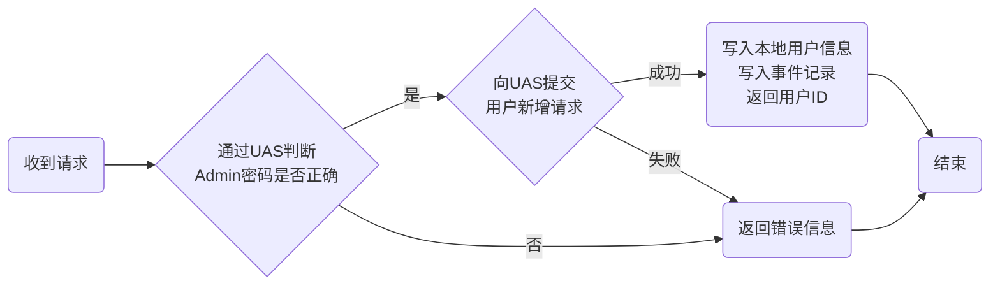

-	权限需求：

	1.	需要验证管理员密码

-	参数:

	1.	uuid - 登录成功获取的uuid  
	2.	pb2 - 详细参数(结构如下)

```protobuf
message rqUserAdd {
    Head head = 1;  // 协议头信息
    string user = 2;  // 新用户登录名(用户登录名不可修改)
    string fullname = 3;  // 新用户全名
    string pwd = 4;  // 新用户密码
    int32 mobile = 7;  // 用户手机
    string tel = 14;  // 用户电话
    string email = 15; // 用户邮箱
    string remark = 16; // 备注
    string admin_pwd = 17;  // admin密码
}
```

返回: CommonAns()

---

### 用户修改

-	接口名称: useredit  
	> 用户信息修改

-	流程图：

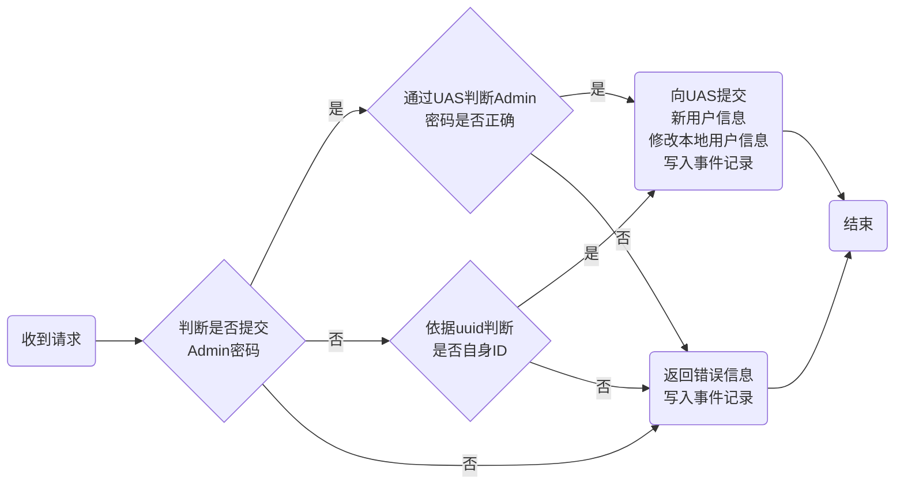

-	权限需求：

	1.	用户可修改自身账户信息
	2.	使用管理员密码可以修改其他用户信息

-	参数:

	1.	uuid - 登录成功获取的uuid  
	2.	pb2 - 详细参数(结构如下)

```protobuf
message rqUserEdit {
    Head head = 1;  // 协议头信息
    string user = 2;  // 要修改的用户id
    string fullname = 3;  // 新用户全名
    string pwd = 4;  // 新用户密码,如为空值表示不改密码
    string pwd_old = 9;  // 旧密码
    int32 mobile = 7;  // 用户手机
    string tel = 14;  // 用户电话
    string email = 15; // 用户邮箱
    string remark = 16; // 备注
    string admin_pwd = 17;  // 管理员密码
}
```

返回: CommonAns()

---

### 用户删除

-	接口名称: userdel  
	> 用户删除, Admin用户不可删除

-	流程图：

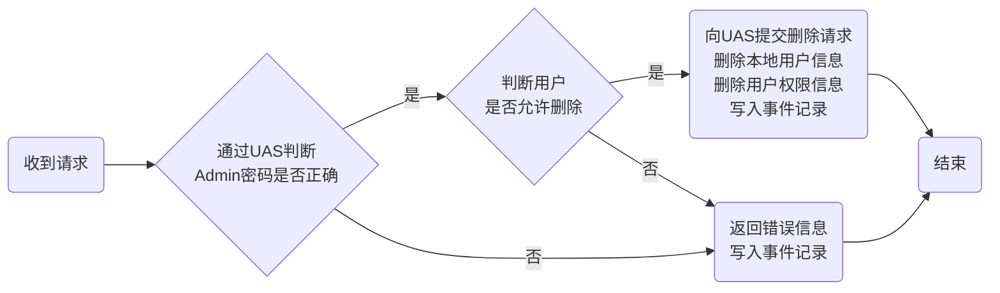

-	权限需求：

	1.	用户需要写权限
	2.	需要验证admin密码

-	参数:

	1.	uuid - 登录成功获取的uuid  
	2.	pb2 - 详细参数(结构如下)

```protobuf
message rqUserDel {
    Head head = 1;  // 协议头信息
    string user = 2;  // 要删除的用户名
    string pwd = 3;  // 要删除的用户密码
    string admin_pwd = 4; // admin密码
}
```

返回: CommonAns()

---

### 事件查询

-	接口名称: querydataevents  
	> 事件查询

-	流程图:


-	权限需求：

	1.	需要用户具有读权限

-	参数:

	1.	uuid - 登录成功获取的uuid  
	2.	pb2 - 详细参数(结构如下)

```protobuf
message rqQueryDataEvents {
    Head head = 1;  // 协议头信息
    int64 dt_start = 5;  // 起始年月日时间,转换为long传输(1970-1-1开始)
    int64 dt_end = 6;  // 结束年月日时间,转换为long传输(1970-1-1开始)
    repeated int32 events_id = 7 [packed=true];  // 事件id
    repeated string user_id = 8;  // 用户id,可多选
    repeated int32 tml_id = 9 [packed=true];  // 设备id,可多选
    repeated int32 project_id = 10 [packed=true];  // 项目id,可多选
}
```

返回:

```protobuf
message QueryDataEvents {
    message DataEventsView {
        int32 events_id = 1;  // 事件id
        string user_name = 2;  // 用户id
        int32 tml_id = 3;  // 设备对象id
        string events_msg = 4;  // 事件内容
        int64 dt_happen = 5;  // 事件发生时间
        string events_name = 6;  // 事件名称
        string project_name = 7;  // 项目名称
    }
    Head head = 1;  // 协议头信息
    repeated DataEventsView data_events_view = 2;
}
```

---

### 消息转发(暂定)

-	接口名称: fwdrequest  
	> 消息转发

-	流程图：

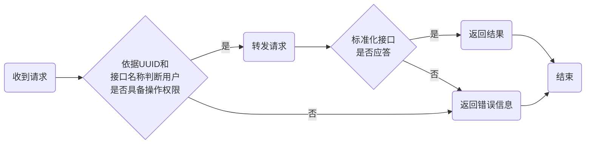

-	权限需求：

	1.	视用户需要转发的请求类型，依据uuid判断用户是否具备对应权限

-	参数:

	1.	uuid - 登录成功获取的uuid  
	2.	ifdist - 转发目标，`ip:port/path`格式，`0`表示广播，向所有项目接口发送
	3.	ifname - 接口名称，参考《标准化接口》相关协议  
	4.	pb2 - 详细参数，参考《标准化接口》相关协议  

返回: 参考《标准化接口》相关协议

---
